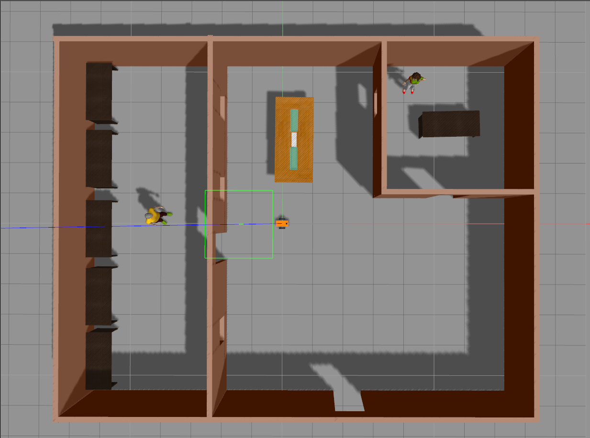
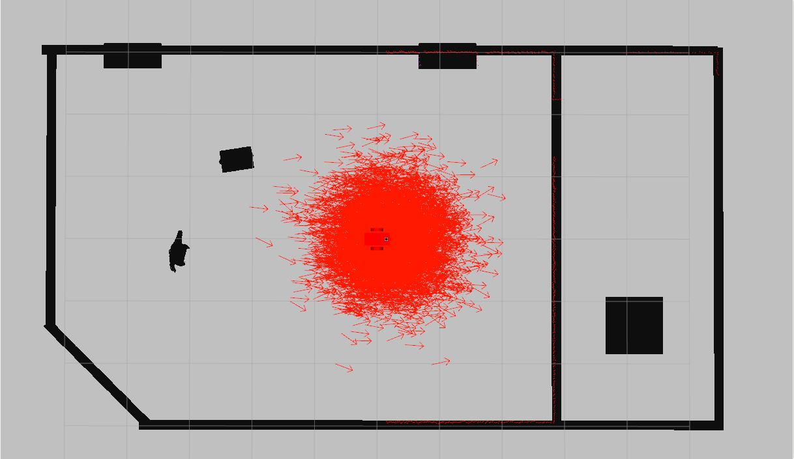
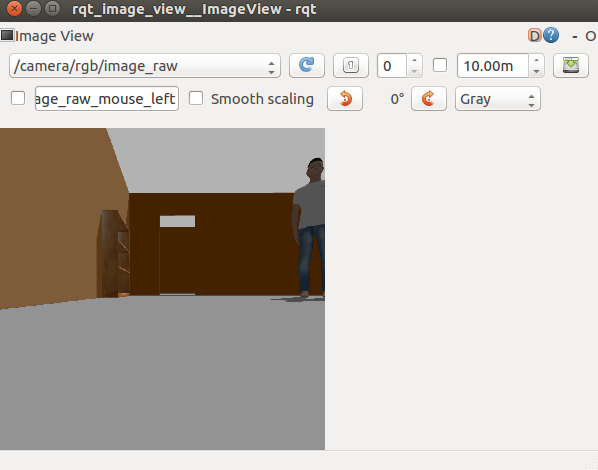

# Project 3 - Where am I?

Gazebo simulation using the AMCL package to localize a robot in a map as it moves around the environment. 

To compile:
```
	cd /path/to/catkin_ws/src/
	catkin_init_workspace
	cd ..
	catkin_make
```

## Launch World 
To launch the world simulation (Gazebo and RVIZ). In one terminal, run:
```
	cd /path/to/catkin_ws/
	source devel/setup.zsh
	roslaunch my_robot world.launch
```

Gazebo should look like this:
<p align="center">
    
</p>

Rviz should look like this:
<p align="center">
   
</p>

## PROJECT 3 - Localization 

After launching the world, open another terminal and run:
```
	cd /path/to/catkin_ws/
	source devel/setup.zsh
	roslaunch my_robot amcl.launch
```

There are two ways to move the robot:

#### RVIZ

On the RVIZ simulation:
1. Click the ```2D Nav Goal``` button in the tool bar. 
2. Click and drag on the map to send the goal to the robot. It will start moving and localize itself in the process. 

#### Teleop package
```
	source devel/setup.zsh
	rosrun teleop_twist_keyboard teleop_twist_keyboard.py
```
Now the robot's movement is controlled using the keyboard. 

This is how the map should look like:
<p align="center">
    
</p>

### Note: Generate a map of the environment
Copy the world file to the pgm_map 
```
	cd /path/to/catkin_ws/
	cp src/my_robot/world/ingrid.world src/pgm_map_creator/world/
```

In one terminal, run:
```
	source devel/setup.zsh
	gzserver src/pgm_map_creator/world/ingrid.world  
```

In another terminal, run:
```
	source devel/setup.zsh
	roslaunch pgm_map_creator request_publisher.launch 
```

And include the generated map in ```my_robot/maps```.

## PROJECT 2 - Launch Ball Chaser

To launch the ball chaser. In another terminal, run:
```
	cd /path/to/catkin_ws/
	source devel/setup.zsh
	roslaunch ball_chaser ball_chaser.launch
```

## Visualize raw image 
To visualize the images from the robot camera, run:
```
	cd /path/to/catkin_ws/
	source devel/setup.zsh
	rosrun rqt_image_view rqt_image_view
```

Make sure to select the topic ```/camera/rgb/image_raw/```. And it should look like this:
<p align="center">
   
</p>


Now you can start moving the white ball in front of the robot in Gazebo. It should start moving left, right or forward, depending on where the ball is. If the robot does not see the ball, it should not move. 