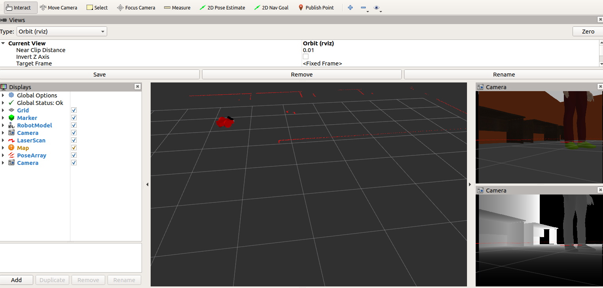

# Robotics Nanodegree

This is my Udacity's Robotics Nanodegree Project.
- Part 1 - ```Build my World```: Designed a Gazebo simulation containing my robot's world. 
- Part 2 - ```Go Chase It```: Designed my robot and used ROS to create a package to move a robot when it sees a white ball. 
- Part 3 - ```Where Am I?```: Used pgm package to create a map of my world and used the ACML package to localize a robot on the map as it moves around the environment. 

Initialize workspace:
```
	cd /path/to/catkin_ws/src/
	catkin_init_workspace
```

To compile:
```
	cd /path/to/catkin_ws/
	catkin_make
```

## Part 1 and 2
To design the world I used a couple of models from [here](http://data.nvision2.eecs.yorku.ca/3DGEMS/). I they are included in ```catkin_ws/src/my_robot/meshes```. To be able to visualize them this path requires to be appended in ```[model_paths]``` in the file ```.gazebo/gui.ini```. 

To launch the world simulation (Gazebo and RVIZ). In one terminal, run:
```
	cd /path/to/catkin_ws/
	source devel/setup.zsh
	roslaunch my_robot world.launch
```

Gazebo should look like this:
<p align="center">
    
</p>

Rviz should look like this:
<p align="center">
   
</p> 

To launch the ball chaser package. In another terminal, run:
```
	cd /path/to/catkin_ws/
	source devel/setup.zsh
	roslaunch ball_chaser ball_chaser.launch
```
## Visualize raw image 
To visualize the images from the robot camera, run:
```
	cd /path/to/catkin_ws/
	source devel/setup.zsh
	rosrun rqt_image_view rqt_image_view
```

Make sure to select the topic ```/camera/rgb/image_raw/```. And it should look like this:
<p align="center">
   
</p>


Now you can start moving the white ball in front of the robot in Gazebo. It should start moving left, right or forward, depending on where the ball is. If the robot does not see the ball, it should not move. 

## Part 3

### Generate a map of the environment
Copy the world in ```my_robot``` package to the ```pgm_map_creator``` package:
```
	cd /path/to/catkin_ws/
	cp src/my_robot/world/navarrs.world src/pgm_map_creator/world/
```

In one terminal, run:
```
	source devel/setup.zsh
	gzserver src/pgm_map_creator/world/navarrs.world  
```

In another terminal, run:
```
	source devel/setup.zsh
	roslaunch pgm_map_creator request_publisher.launch 
```

And include the generated map in ```my_robot/maps```. The map should look like this:
<p align="center">
   
</p>

To test the AMCL package. Launch the world as in ```part 1 and 2```. After launching the world, open another terminal and run:
```
	cd /path/to/catkin_ws/
	source devel/setup.zsh
	roslaunch my_robot amcl.launch
```
This is how the map in RVIZ using the AMCL package should look like:
<p align="center">
    
</p>

There are two ways to move the robot:

#### RVIZ

On the RVIZ simulation:
1. Click the ```2D Nav Goal``` button in the tool bar. 
2. Click and drag on the map to send the goal to the robot. It will start moving and localize itself in the process. 

#### Teleop package
```
	source devel/setup.zsh
	rosrun teleop_twist_keyboard teleop_twist_keyboard.py
```
Now the robot's movement is controlled using the keyboard. 