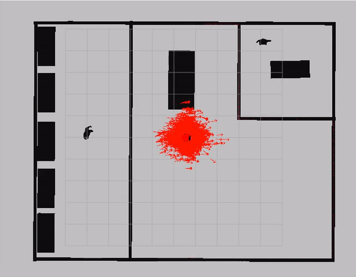
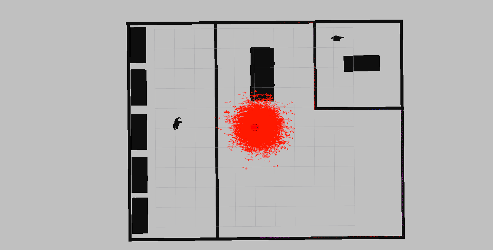

# Localization package

This package is used to perform self localizaiton. 
<p align="center">
   
</p>

### Launch the localization package
To launch RTAB's localization module, run:
```
  ./scripts/localization.zsh  -r robot_name -w world_name
```
To launch AMCL's localization module, run:
```
  ./scripts/amcl.zsh  -r robot_name -w world_name -m mode 
```
Where:
* ```robot_name``` is either ```dummy```
* ```map``` is either ```pgm_map``` or ```rtab_map```
* ```mode``` is either ```keyboard``` or ```goal```. If the former is used, you will control the robot using the keyboard. If the latter is used, you can set a navigation goal directly from RVIZ, i.e;
1. Click the ```2D Nav Goal``` button in the tool bar. 
2. Click and drag on the map to send the goal to the robot. It will start moving and localize itself in the process. 

After launching the localization module, RVIZ should have a map and an array arrows indicating the current location of the robot:
<p align="center">
   
</p>