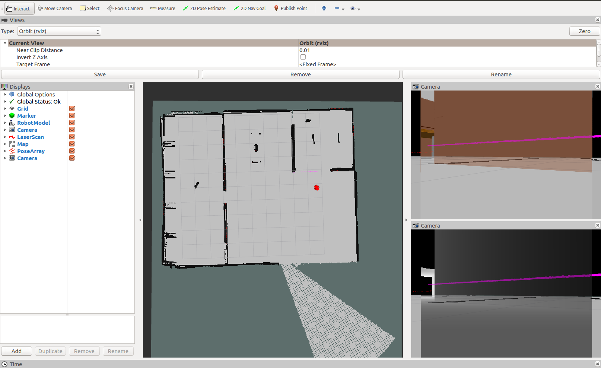

# Mapping package

This package is used to map the environment. 
<p align="center">
    
</p>

To launch the mapping module, run:
```
  ./scripts/rtab_mapping.zsh  -r robot_name
```
Where:
* ```robot_name``` is ```dummy```.

You should see the RTABMAP visualization:
<p align="center">
    
</p>

And this is how it should look on RVIZ: 
<p align="center">
   
</p>

Now you can explore the world using the teleop package. And the map will be generated. Once it's done --and BEFORE closing the terminals-- open a new terminal to save the map:
```
  cd /path/to/catkin_ws/
  source devel/setup.zsh
  rosrun map_server map_saver -f src/database/maps/rtab_map
```

To analyze the database, run:
```
	cd /path/to/catkin_ws/
	rtabmap-databaseViewer src/database/slam/rtabmap.db
```
<p align="center">
    
</p>