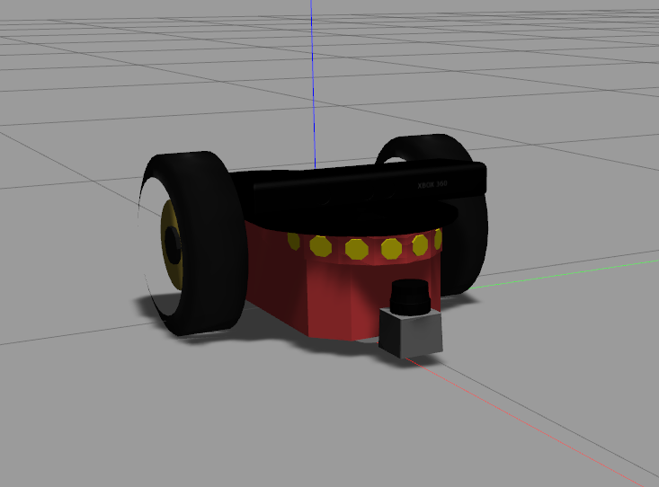

# Robot package

This package stores the robot model. 

## Spawn a Robot and a World
To spawn a robot in ```gazebo```, run:
```
  ./scripts/spawn.zsh -r robot_name -w world_name
``` 
Where:
* ```robot_name``` is ```dummy```. 
* ```world_name``` is ```house```, ```walls``` or ```empty```. 

This is the current robot:
<div align="center">
  
</div>

This is an example of a custom world:
<p align="center">
    
</p>

### Notes:
* To design the world, I used models from [here](http://data.nvision2.eecs.yorku.ca/3DGEMS/). They are included in gazebo's default model path. To be able to visualize download the models and save them to ```.gazebo/models```. 
* If you can't see the models correcly you might need to download them from [here](http://data.nvision2.eecs.yorku.ca/3DGEMS/) or adjust the paths in the ```.world``` or ```.urdf``` files in the [database package](https://github.com/XLabRD/XLB--sanchez/tree/REFACTOR_readme-cleanup/catkin_ws/src/database).
* You can design custom robots and world and launch them using this script.
