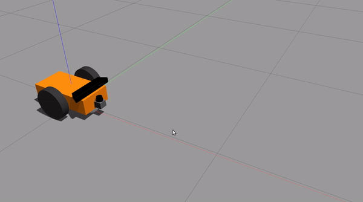
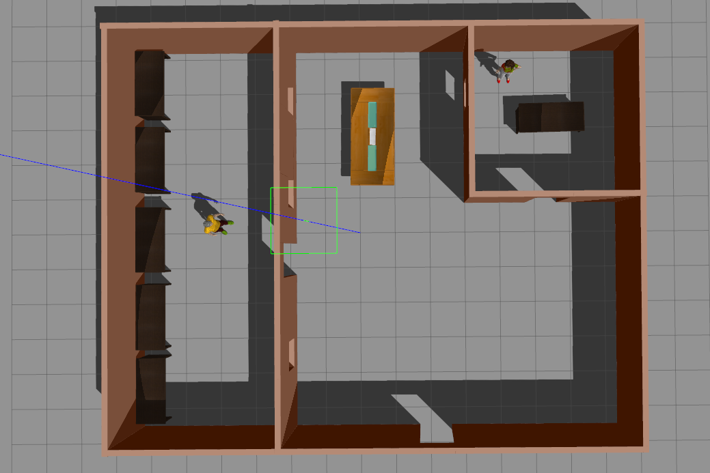
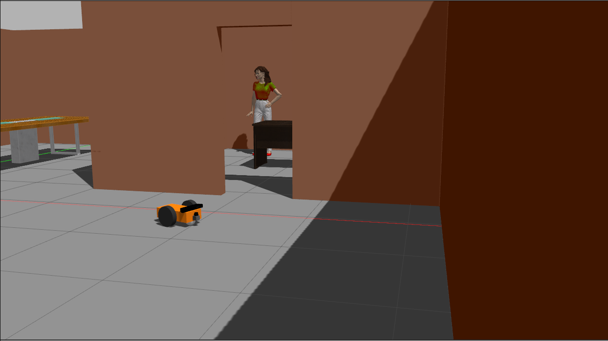

# Robot package

This package stores the robot model. 

## Spawn a Robot
To spawn a robot in ```gazebo```, run:
```
  ./scripts/robot_spawn.zsh -r dummy
``` 

You should the following robot:
<div align="center">
  
</div>

## Launch World 
To design the world, I used models from [here](http://data.nvision2.eecs.yorku.ca/3DGEMS/). They are included in gazebo's default model path. To be able to visualize download the models and save them to ```.gazebo/models```. 

To launch the world without a robot, run:
```
  ./scripts/world.zsh -r none
```

You should see:
<p align="center">
    
</p>

To launch the world with Gazebo and RVIZ, as well as a robot, run:
```
  ./scripts/world.zsh -r robot_name
```
Where:
* ```robot_name``` is ```dummy```. 

You should see either robot as:
<div align="center">
  
 
</div>

Rviz should look like this:
<p align="center">
   
</p>

## Troubleshooting

If you can't see the models correcly you might need to download them from [here](http://data.nvision2.eecs.yorku.ca/3DGEMS/) or adjust the paths in the ```.world``` or ```.urdf``` files in the [database package](https://github.com/XLabRD/XLB-hugo-sanchez/tree/REFACTOR_readme-cleanup/catkin_ws/src/database).